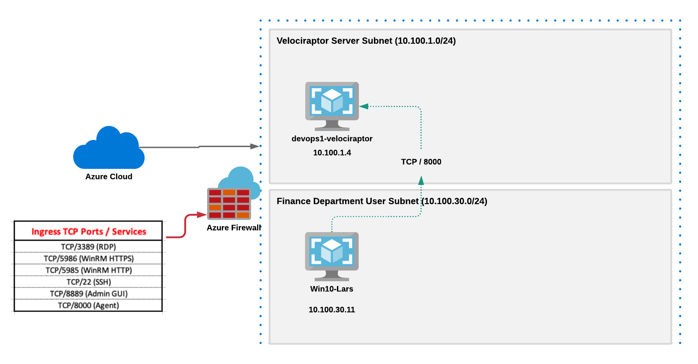

# Overview:  Velociraptor_Azure
Automated Terraform deployment of Velociraptor in Azure!  Automated deployment of one Velociraptor server with one registered Windows 10 endpoint in Azure VM infrastructure.  A collection of Terraform and Ansible scripts that automatically (and quickly) deploys a small Velociraptor R&D lab.

# Quick Fun Facts:
* Deploys one (1) Ubuntu Linux Velociraptor Server and one (1) Windows 10 Professional endpoint
* Automatically registers the endpoint to the Velociraptor server with TLS self-signed certificate configuration
* Uses Terraform templates to automatically deploy in Azure with VMs
* Terraform VM modules are flexible, allowing you to add your own new VMs in Azure
* Velociraptor server service is installed via Debian package
* Terraform templates write Ansible Playbook configuration, which can be customized
* Deployment Time:  Approximately 8 minutes and 50 seconds
* Azure Network Security Groups (NSGs) can whitelist your source prefix, for added security
* The following ports are opened through Azure NSGs for ingress TCP traffic:  RDP (3389), WinRM HTTP (5985), WinRM HTTPS (5986), SSH (22), Velociraptor GUI (8889), Velociraptor Agent (8000)

# Infrastructure and Credentials
* Windows 10 VM Admin credentials:  VAdmin:Password123
* Velociraptor Linux OS username:  vadmin (Uses SSH public key auth)
* Velociraptor GUI Administrator Password for Port 8889:  vadmin:vadmin
* Server Subnet (Velociraptor):  10.100.1.0/24
* User Subnet (Windows 10 VM):  10.100.30.0/24
* Velociraptor Internal IP:  10.100.1.4
* Windows 10 VM Internal IP:  Dynamic

# Remote Access (After Deployment)
* Windows 10 VM:  Change into the modules/win10-vm1 directory and view contents of hosts.cfg.  The second line should show the IP address of the Windows 10 VM.  Just RDP to it with Admin credentials above.
* Velociraptor Server:  Change into the modules/velociraptor directory and view contents of hosts.cfg.  The second line should show the IP address of the Velociraptor server that is provisioned a public IP from Azure.  You can SSH to the host from within that directory:
```
$ ssh -i ssh_key.pem vadmin@<IP ADDRESS>
```
* Velociraptor GUI:  Use the step above to get the public Azure IP address of the Velociraptor Server.  Use Firefox browser to navigate to:
```
https://<IP ADDRESS>:8889
```

**Note:**  Tested on Ubuntu Linux 20.04 

# Requirements
* Azure subscription
* Terraform:  Tested on v0.13.4
* Ansible:  Tested on 2.9.6
* A version of Linux that will run velociraptor binary (x64) - Note:  The terrraform deployment system runs a version of Velociraptor from the binary releases page in order to build the configuration, which is copied to the actual Velociraptor server and client.  If you are running other than Ubuntu with x64 (i.e., MacOS), simply copy the binary release for your platform into the modules/velociraptor directory.  This is the binary release that is included in this deployment, so just make sure that it runs with your native OS:  velociraptor-v0.5.0-1-linux-amd64

## Installation Steps

**Note:**  Tested on Ubuntu 20.04

**Step 1:** Install Terraform and Ansible on your Linux system

Download and install Terraform for your platform --> https://www.terraform.io/downloads.html

Install Ansible
```
$ sudo apt-get install ansible
```

**Step 2:** Set up an Azure Service Principal on your Azure subscription that allows Terraform to automate tasks under your Azure subscription

Follow the exact instructions in this Microsoft link:
https://docs.microsoft.com/en-us/azure/developer/terraform/getting-started-cloud-shell

These were the two basic commands that were run based on this link above:
```
az ad sp create-for-rbac --role="Contributor" --scopes="/subscriptions/<subscription_id>
```
and this command below.  From my testing I needed to use a role of "Owner" instead of "Contributor".  Default Microsoft documentation shows role of "Contributor" which resulted in errors.  
```
az login --service-principal -u <service_principal_name> -p "<service_principal_password>" --tenant "<service_principal_tenant>"
```
Take note of the following which we will use next to configure our Terraform Azure provider:
```
subscription_id = ""
client_id = ""
client_secret = ""
tenant_id = ""
```

**Step 3:** Clone this repo
```
$ git clone https://github.com/iknowjason/Velociraptor_Azure.git
```

**Step 4:** Using your favorite text editor, edit the terraform.tfvars file for the Azure resource provider matching your Azure Service Principal credentials

```
cd Velociraptor_Azure/deploy
vi terraform.tfvars
```

Edit these parameters in the terraform.tfvars file:
```
subscription_id = ""
client_id = ""
client_secret = ""
tenant_id = ""
```

Your terraform.tfvars file should look similar to this but with your own Azure Service Principal credentials:
```
subscription_id = "aa9d8c9f-34c2-6262-89ff-3c67527c1b22"
client_id = "7e9c2cce-8bd4-887d-b2b0-90cd1e6e4781"
client_secret = ":+O$+adfafdaF-?%:.?d/EYQLK6po9`|E<["
tenant_id = "8b6817d9-f209-2071-8f4f-cc03332847cb"


**Step 5**  Edit the terraform.tfvars file to include your source network prefix
Edit the following file:  deploy/terraform.tfvars
At the bottom of the file, uncomment the "src_ip" variable and populate it with your correct source IP address.  If you don't do this, the Azure NSGs will open up your two VMs to the public Internet.  Below is exactly where the variable should be uncommented and an example of what it looks like:
```
#Set variable below for IP address prefix for white listing Azure NSG
#ncomment; otherwise, all of the public Internet will be permitted
#ttps://ifconfig.me/
#curl https://ifconfig.me
src_ip = "192.168.87.4"
```

**Step 6** Run the commands to initialize terraform and apply the resource plan

```
$ cd Velociraptor_Azure/deploy
$ terraform init
$ ./create.sh
```

This should start the Terraform automated deployment plan


# Shutting down / cleaning up
```
$ cd Velociraptor_Azure\deploy
$ ./destroy.sh
```
